# 垃圾词典微信小程序

# 1.    项目分析

## 1.1.   项目概述

### 1.1.1.  项目主题：垃圾分类信息查询微信小程序

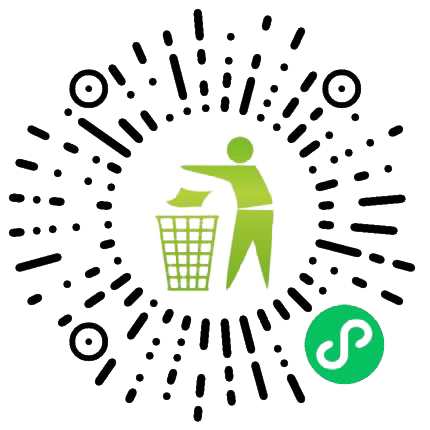

图 1‑1 垃圾词典小程序码

### 1.1.2.  项目功能

• 垃圾分类查询

• 垃圾分类简介

• 历史查询记录

• 小程序个性化设置

### 1.1.3.  用户分析

“绿色环保”一直是国家大力提倡的口号。随着人们环保意识逐渐增强，各大城市逐渐开始实行垃圾分类的环保政策。但是相信很多市民还是经常不明白垃圾应该如何具体地分类。诚然，我们可以在需要丢弃垃圾时通过在线搜索的方式查询垃圾的分类规则，但是考虑到垃圾的种类复杂，日常生活中我们投放垃圾的频率也比较高，倘若每次都上网查找，这无疑是不方便的，人们难以及时、高效地获取有效信息，这增大了垃圾分类的时间成本和精力成本。因此，一款垃圾分类小程序就显得十分必要了，它能够有效地解决上述问题，不仅可以帮助人们方便、快速和准确地进行垃圾分类，为广大有垃圾分类需求的群体解决痛点，还可以普及垃圾分类的基本知识，督促大家养成环保习惯。相信在我们小程序的助力下，垃圾分类政策一定能够得到更加有力的实施。

## 1.2.   需求分析

### 1.2.1.  选题意义

在移动互联网时代，微信已然成为了一种全新的生活方式，深深地影响着数以亿计的人们的生活。微信小程序即需即用，省去了用户下载安装的繁琐步骤，为新时代新型移动端应用程序探索了可能。因此，垃圾词典微信小程序就是基于这一理念，将垃圾分类和这样一种高效便捷的应用程序形式相结合。近年来，由于我国人口规模庞大，所产生的垃圾堪称是巨量，城市垃圾处理能力严重不足，而据统计，进行垃圾分类可以使人均生活垃圾产生量减少三分之二，有利于垃圾品质的改善、垃圾的回收利用和无害化处理，所以推行垃圾分类是很有必要的。越来越多的城市加入到垃圾分类的队伍中，但还是有很多人对于“是什么垃圾”这一问题存在疑惑。我们的小程序可以在用户输入所要扔的垃圾名称后显示该垃圾的种类，以解决用户在垃圾分类中所遇到的问题。

垃圾词典小程序不需要投入太多的时间成本和人工成本就可以使用。同时，微信小程序的受众群体更为广泛，在各种不同时间段、不同环境中都能方便大家使用。

小程序交互界面设计美观、场景丰富，免下载安装，即用即退，不占用桌面空间，就可以满足用户的使用需求。小程序的生态系统也十分完善和成熟，可以让用户获得更加完美的使用体验。

对于移动端用户，微信小程序从性能和便捷性上优于网页。如今，在智能手机普及率较高的时代，垃圾词典小程序面向移动端用户，旨在使接触更便捷、操作更简单、设计更美观，通过其优势扩大影响力，服务于需要进行垃圾分类的人群。

### 1.2.2.  可行性分析

**技术可行性**：本项目组成员具备微信小程序开发经验，了解数据库的基本操作和原理，能够熟练使用前端框架。同时，我们修读了人机交互技术课程，能够将人机交互原理应用于微信小程序的开发中，从用户的角度出发，在满足用户的需求的前提下，提升用户的使用体验，解决用户的使用痛点。

**组织可行性**：本项目小组将制定合理的项目实施进度计划，安排合理的组织机构和成员分工，建立良好的团队协作关系，从而保证项目的顺利执行。

**社会可行性**：本小程序的适用对象是需要进行垃圾分类的人群。微信小程序扫码即可使用，便于分享，使得推广工作更容易进行。

## 1.3.   项目交互式特点

### 1.3.1.  极简的UI设计

小程序主界面包含一个搜索框和四个垃圾桶图标，小程序将处理用户最重要需求的页面元素（输入框）放在最明显的位置，方便用户直达搜索功能，简化了其他繁杂的操作步骤，从而提高了用户的使用效率。

### 1.3.2.  考虑用户单手握持的情况

在UI设计时考虑用户单手握持的情况，因此将小程序最核心的搜索框放在用户单手手指可触控范围内，便于用户单手操作。

### 1.3.3.  全局深色模式

小程序完成了全部页面的深色模式适配。当手机系统进入深色模式后，小程序也会自动切换为深色模式。从普通模式变为深色模式，对文字和系统图标的颜色做了优化处理，确保人眼观看感受的一致性、舒适性和阅读的易读性，从而可以缓解用户的视觉疲劳。

### 1.3.4.  颜色语义

根据垃圾分类标准中的不同颜色的垃圾桶，将查询结果具像化为对应颜色的垃圾桶卡片图标，用户甚至可以直接根据查询结果的颜色来区分垃圾的种类，可以减少用户思考（即：用户将垃圾投放至现实生活中对应颜色的垃圾桶即可）。同时在历史查询记录页面同样应用了颜色语义，方便用户投放垃圾。

### 1.3.5.  出错提示

当用户输入为空，或者没有查询到结果时及时给用户反馈。出错提示采用精心设计的图标和交互动画，同时反馈信息可以自动隐藏，有效减少用户关闭反馈信息的操作步骤。

### 1.3.6.  网络请求超时处理

当用户输入内容并点击查询图标后，如果系统服务器出现问题或者用户网络没有连接，小程序可以给用户及时的反馈，提示用户网络请求超时，避免用户忙等从而产生消极情绪。

### 1.3.7.  网络请求动画

当用户输入内容并点击查询图标后，在查询结果从服务器获取之前，小程序页面显示加载动画，避免用户误认为系统出现问题，发生页面卡死的情况，从而消除用户等待时的负面情绪。

### 1.3.8.  新用户使用引导

当用户首次进入小程序时，小程序显示引导界面，提示用户小程序核心功能和使用方法，方便用户使用小程序。

### 1.3.9.  交互动画设计

小程序全局采用了大量精心设计的、流畅生动的交互效果动画，小程序可以在满足用户功能需求的同时，给用户带来愉快舒适的使用体验。

### 1.3.10. 屏幕适配

小程序实现了响应式布局，即在不同屏幕比例的设备上呈现出一致的效果，以此给用户带来统一的使用体验。

### 1.3.11. 手势操作

采用左右滑动的手势进入背景设置界面和历史记录界面，能够简化用户的交互步骤，使得小程序更容易上手使用。用户不需要寻找菜单图标，只需在屏幕的任意位置使用手势交互即可完成相应的逻辑功能：左滑进入历史查询记录页面，右滑进入个性化设置页面。

### 1.3.12. 个性化设置背景时实时预览背景

用户设置背景时，选择背景颜色或切换背景图片时可以实时地预览当前背景的效果，及时给用户操作反馈，方便用户找到自己最喜爱的背景，定制个性化的微信小程序。

# 2.    概要设计

## 2.1.   系统设计大纲

### 2.1.1.  总体设计

垃圾词典微信小程序采用前后端分离的开发模式。前端关注小程序页面的显示和人机交互；后端完成数据库的操作，两者之间通过接口完成数据和消息的传递。同时将后端服务器程序部署在阿里云服务器。

项目前端采用WXML+ WXSS+JavaScript语言，基于微信开发者工具开发小程序；项目后端采用MySQL数据库，通过ThinkPHP框架完成项目接口的开发，选用Nginx服务器程序维持前后端通信。

### 2.1.2.  界面设计

根据图形用户界面设计的一般原则，对小程序界面完成设计：

**界面要具有一致性：**在设计小程序时，使用相同的界面风格，包括颜色、字体、布局、行距，间距等，最终选择以青苹果绿（#80BF00）为小程序主体颜色，绿色象征着环境保护的主题，这与垃圾分类小程序的主要功能相契合。

**合理划分并高效地使用显示屏幕，实现极简布局：**小程序主界面为一个搜索框，将处理用户最重要需求的页面元素（输入框）放在最明显的位置，方便用户直达搜索功能，简化了其他繁杂的操作步骤，提高了用户的使用效率。在UI设计时考虑用户单手握持的情况，因此将小程序最核心的搜索框放在单手手指可触控范围内，便于用户单手操作。

**常用操作要有快捷方式：**对于查看垃圾分类简介的功能，用户可以点击查询结果，查看对应的垃圾分类简介，了解垃圾分类的基本知识。或者直接点击主页下方的四个垃圾桶图标，不必在每次查询后再点击查询结果，进入简介界面，从而直接查看简介信息。

### 2.1.3.   交互设计

小程序中应用了大量的精心设计的、流畅生动的交互效果动画，可以在满足用户功能需求的同时，给用户带来愉快的使用体验。采用左右滑动的手势进入设置界面和历史记录界面，简化用户的交互步骤，使得小程序更容易使用。当用户首次进入小程序时显示引导界面，给用户提示小程序的使用方法，方便用户使用小程序。

**根据图形用户界面设计的一般原则，提供信息反馈**：用户使用时，在搜索框中输入相应的垃圾名称后，用户可以点击输入框右侧的删除按钮清空输入框；

输入完成后用户点击输入框右侧的放大镜图标提交搜索请求，此时搜索框会以流畅生动的动画转移到页面的左上角，变成一个搜索图标，而小程序logo则会缩小上移，最终消失，以把屏幕空间留给接下来的查询结果或者异常提示内容的显示，从而更加高效地使用显示屏幕；用户设置背景时就能看到当前背景的效果，及时给给用户反馈，方便用户找到最喜爱的背景。

在网络请求的过程中，小程序会一直显示加载动画，告诉用户小程序目前正在发送请求，给用户展示小程序当前加载的状态，避免用户认为小程序出现卡死或发生故障，以此缓解用户等待时的心理压力，提升用户的交互体验。

根据垃圾分类标准中的不同颜色的垃圾桶，将查询结果具像化为对应颜色的垃圾桶卡片，用户甚至可以直接通过颜色来区分垃圾的种类，减少用户思考（即：用户将垃圾投放至现实生活中对应颜色的垃圾桶即可）。

如果系统成功返回对应的垃圾所属类别，则对应的垃圾桶会从小程序主页下方流畅地放大至屏幕中心，给用户直观的分类感受：用户应该把这一类垃圾投放在这一个垃圾桶中。选择现实世界垃圾分类中的垃圾桶的颜色作为小程序主页下方对应垃圾桶的颜色，将颜色这一具象的物理信息和抽象的垃圾分类种类信息相结合，使得用户看到某一颜色就知道对应的查询结果，满足用户的直觉和认知，以此提高用户的使用效率。

如果用户点击屏幕中央的垃圾桶，即可进入关于该类垃圾介绍的详情界面，以便进一步了解该类垃圾所包含垃圾种类的常见情况，方便用户了解垃圾分类的基本信息和规则。此时，用户点击屏幕的任意位置，即可回到小程序主页。如果用户不想查看垃圾分类的简介，只需点击位于屏幕中心的垃圾桶周围的深色区域，小程序会以流畅生动的动画将这一个垃圾桶缩小至原来的位置。与此同时，主页的其他元素会重新显示出来，等待用户下一步操作。

**根据图形用户界面设计的一般原则，提供必要的错误处理功能**。对于用户或系统的异常情况，我们的小程序给出了友好的处理流程：

当用户输入为空，或者没有查询到结果时，显示“别忘了输入”或“没找到”的消息提示，并且在3秒钟后自动返回小程序主页，及时给用户反馈。出错提示采用精心设计的图标，同时反馈信息自动隐藏，减少用户关闭反馈信息的操作步骤。

如果网络没有连接或接口调用出现问题，则显示“网络故障”的消息提示，并且在3秒钟后自动返回小程序主页，给用户及时的反馈，避免用户忙等产生消极情绪。

此外，我们的小程序完成了全部页面的深色模式适配。当手机系统进入深色模式后，小程序也会自动切换为深色模式。深色模式采用了最优的文字前景与深色背景对比度，同样的色彩，在浅色背景和深色背景上人眼视觉感知的亮度与饱和度是不同的。从普通模式变为深色模式，对文字和系统图标的颜色做了优化处理，确保人眼观看感受的一致性、舒适性和阅读的易读性。

小程序在深色模式状态下，背景颜色采用深色，文本颜色适当减少了明度。此外，取消了主页输入框的边框，适当调节了垃圾桶的颜色值，以及小程序中所有图片的亮度值，使得深色模式下界面更加简约、统一、和谐，这样还能缓解用户视觉疲劳。相信小程序的深色模式能给在夜间使用本小程序的用户更好的体验。

响应式布局能够对不同分辨率的设备自适应布局，快捷解决多设备显示统一的显示问题。我们的小程序能在不同屏幕比例的设备上呈现出一致的效果，以此给用户统一的使用体验。

### 2.1.4.  逻辑安排

用户启动小程序，首次进入时会显示小程序引导页面，提示新用户小程序的使用方法，点击屏幕任意位置即可开始使用。

用户在输入框内输入所要查询的垃圾名称，点击右侧的放大镜图标即可开始查询，查询成功时，相应的垃圾桶会从屏幕下方放大至屏幕中心，可以根据垃圾桶的颜色和文字判断垃圾类别，准确实现垃圾分类。此时，点击垃圾桶周围的深色区域，即可关闭查询结果，返回小程序主页；如果点击垃圾桶，即可查看垃圾分类简介，近一步了解垃圾分类的基本信息和规则。然后点击屏幕任意位置，即可返回小程序主页。此外，如果直接点击主页下方的垃圾桶，还可以直接查看垃圾分类简介。

如果没有输入内容直接搜索，小程序会提示“别忘了输入”，并在3秒后自动关闭提示；如果网络没有连接或系统接口调用出现问题，小程序会提示“网络请求超时”，并在3秒后自动关闭提示；如果在系统中没有查到对应的垃圾分类结果，小程序会提示“没找到”，并在3秒后自动关闭提示。

用户在小程序主页左滑屏幕，可以查看最近的查询记录。可以查看用户最近的10条搜索记录，对应的类别颜色和垃圾桶颜色一致，便于快速获取分类信息，右滑屏幕即可返回小程序主页。

用户在小程序主页右滑屏幕，可以个性化设置小程序背景。用户可以直接选择自己喜欢的纯色背景或默认的三种背景图，还可以从相册挑选自己喜欢的图片作为小程序的背景。用户还可以设置背景模糊，以提高文字的对比度。设置完成后左滑屏幕即可返回小程序主页。

### 2.1.5.  模块设计

小程序主体分为小程序主页、小程序设置、历史记录、简介信息、查询结果五大模块。在小程序前端开发时，没有使用微信小程序框架自带的页面路由功能实现五大模块之间的页面跳转，而是通过构建单页面应用，通过动画函数实现页面的显示和隐藏，以此为更多交互效果的实现带来可能。

## 2.2.   设计图展示

### 2.2.1.  用例图

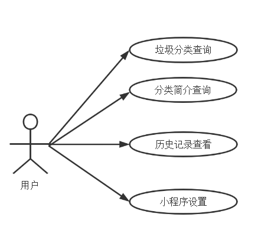

图 2‑1 小程序用例图

### 2.2.2.  任务金字塔

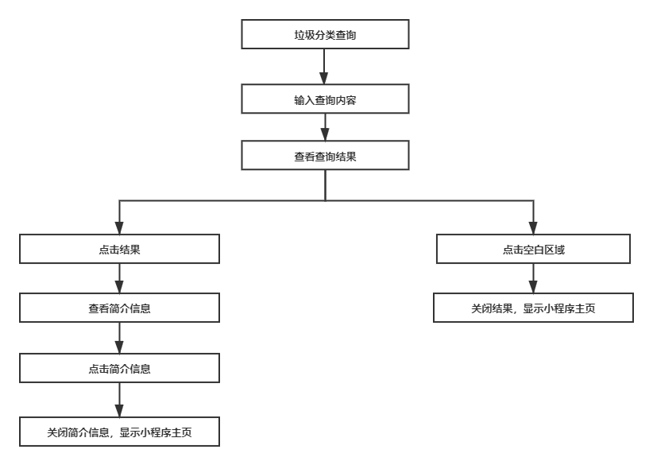

图 2‑2 垃圾分类查询任务金字塔

 

### 2.2.3.  视图关联设计

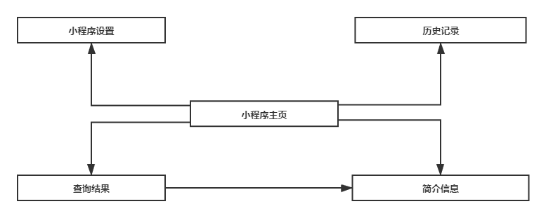

图 2‑3 小程序视图关联设计

### 2.2.4.  错误处理流程图

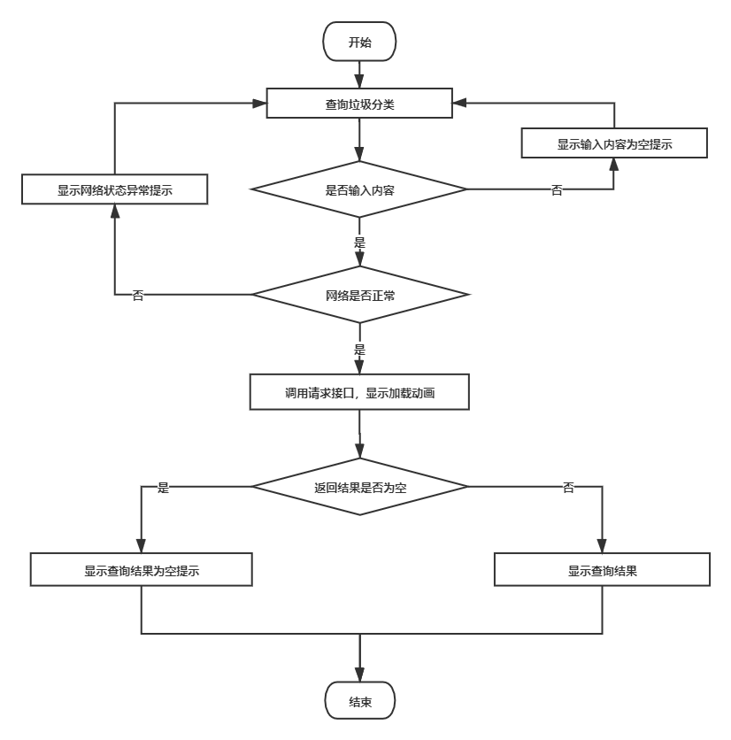

图 2‑4 小程序出错处理流程图

 

### 2.2.5.  时序图

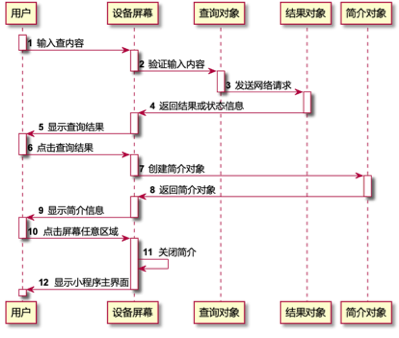

图 2‑5 用户查询垃圾分类并查看分类简介的时序图

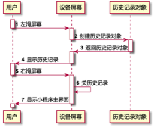

图 2‑6 用户查询垃圾分类历史记录的时序图

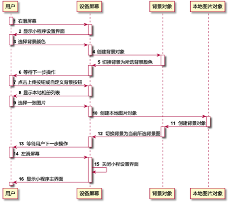

图 2‑7 用户个性化设置小程序背景的时序图

# 3.    项目展示

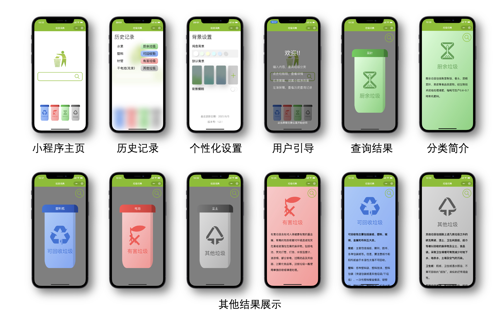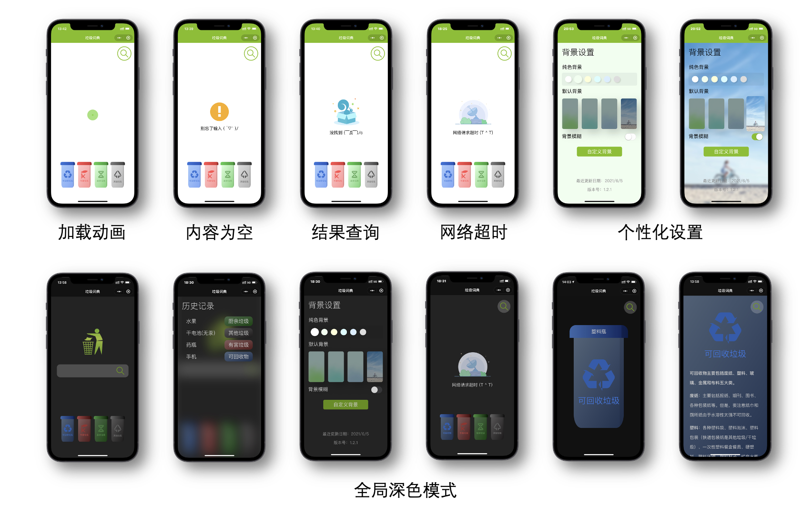

图 3‑1 小程序手机端页面展示

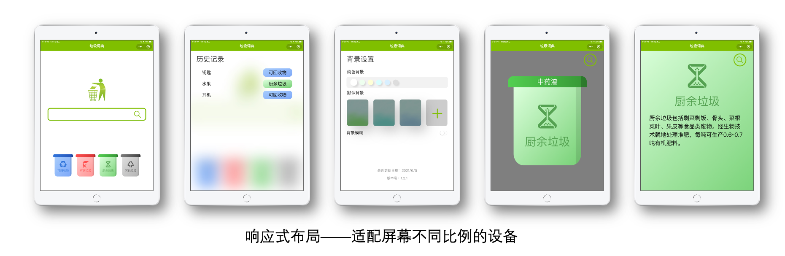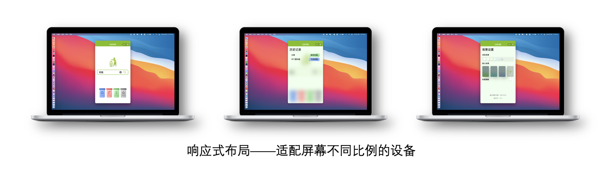

图 3‑2 小程序iPad端和电脑端页面展示